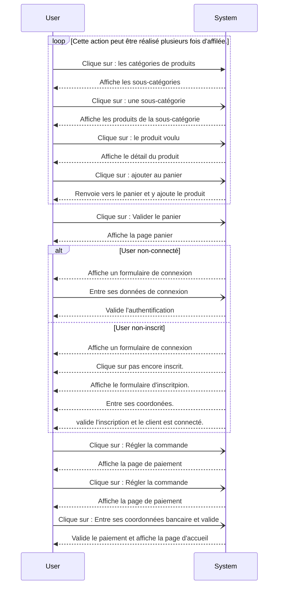

```mermaid
sequenceDiagram

loop Cette action peut être réalisé plusieurs fois d'affilée.
    User->>System: Clique sur : les catégories de produits
    System-->>User: Affiche les sous-catégories

    User-)System: Clique sur : une sous-catégorie
    System-->>User: Affiche les produits de la sous-catégorie
    
    User-)System: Clique sur : le produit voulu
    System-->>User:Affiche le détail du produit

    User-)System: Clique sur : ajouter au panier
    System-->>User:Renvoie vers le panier et y ajoute le produit
    end

    User-)System: Clique sur : Valider le panier
    System-->>User:Affiche la page panier

    
alt User non-connecté
    System-->>User:Affiche un formulaire de connexion
    User-)System: Entre ses données de connexion
    System-->>User:Valide l'authentification
    
else User non-inscrit
    System-->>User:Affiche un formulaire de connexion
    System-->>User:Clique sur pas encore inscrit.
    System-->>User:Affiche le formulaire d'inscritpion.
    System-->>User:Entre ses coordonées.
    System-->>User:valide l'inscription et le client est connecté.

end
    User-)System: Clique sur : Régler la commande
    System-->>User:Affiche la page de paiement
    
    User-)System: Clique sur : Régler la commande
    System-->>User:Affiche la page de paiement
    
    User-)System: Clique sur : Entre ses coordonnées bancaire et valide 
    System-->>User:Valide le paiement et affiche la page d'accueil

```

